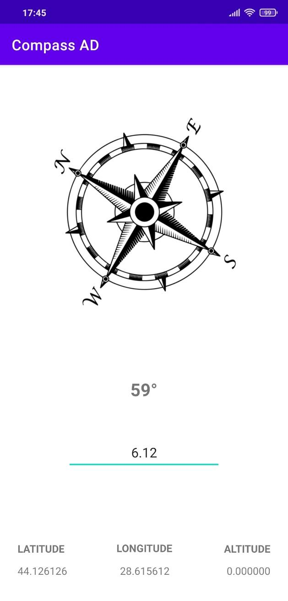

# CompassAD

**CompassAD** is an Android application that displays a compass along with GPS coordinates and altitude.

GPS coordinates, along with the displayed compass, provide the user with essential orientation information, thus being able to navigate to a known destination.

The "Magnetic declination" text box allows the user to set a magnetic declination[^1] value, in decimal degrees.

 

    

[^1]: In Geophysics, the magnetic declination is the angle formed by the direction of the magnetic needle of the compass with the geographic north-south direction, due to the fact that the geographic poles do not coincide with the magnetic ones.
